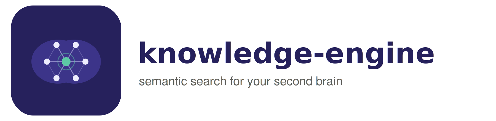
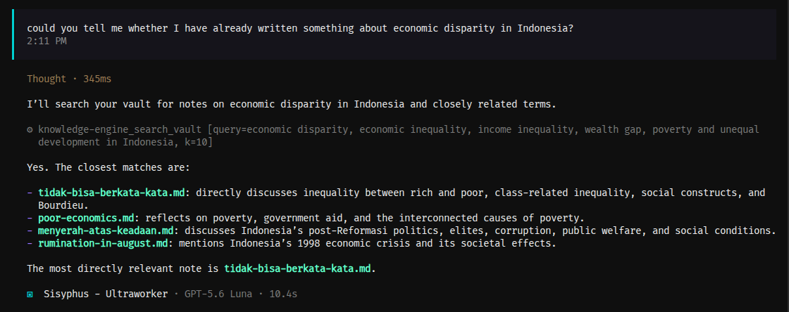

# knowledge-engine



Semantic search over your Obsidian vault, a **Minimum Viable Second Brain** for you and your AI agents.

## Why

On a daily basis, I use Obsidian to capture and dump everything I learn. Insights, gotchas, and tricks I discover while working, researching, reading books or websites, or building personal projects. At the same time, I use Opencode with multiple agents, each maintaining its own memory and skills files.

The problem is that whenever I learn something new, whether it's a testing pattern, a language gotcha, a food recipe, the meaning of "oxymoron" or anything else, I write it down in Obsidian, but my AI agents can't access it. They only know what's stored in their manually curated memory files, so every new insight has to be onboarded manually.

This project bridges that gap. Instead of copying knowledge from Obsidian into each agent's memory by hand, I want the agents to retrieve relevant notes on demand through semantic search. Obsidian remains the single source of truth, while the RAG layer makes that knowledge queryable by AI.

**Example queries it's designed to answer:**

- "When have I written about eventual consistency?"
- "What books have influenced my thinking on inequality?"
- "Show me every note where I compared software engineering with economics."

The initial idea came from reading blog posts and articles about building RAG systems over personal knowledge bases.

## Philosophy

Personally, the trap of personal knowledge systems is chasing the _"perfect second brain"_ by implementing GraphRAG, Neo4j, five Obsidian plugins, autonomous agents and such. And i felt like, i was going to spend more time maintaining the system rather than learning.

When I begun this project, it takes the opposite approach: a **Minimum Viable Second Brain (MVSB)** . Start with the core loop that delivers value, then expand only when the foundation proves useful.

| Step                   | Purpose                          | Don't optimize yet              |
| ---------------------- | -------------------------------- | ------------------------------- |
| Embeddings + Vector DB | Semantic memory                  | Which embedding model is "best" |
| Indexer                | Keeps the knowledge base updated | Fancy chunking strategies       |
| Connect to Opencode    | Makes notes usable by AI         | Multi-agent orchestration       |
| Ask real questions     | Validates usefulness             | Benchmark scores                |
| Curator features       | Gradually improves note quality  | Full automation                 |

## Architecture

```
               Obsidian
                  |
                  | Markdown
                  v
          Background Indexer
                  |
     +------------+------------+
     |                         |
 Embedding DB              Knowledge Graph
(LanceDB)                 (planned / optional)
     |                         |
     +------------+------------+
                  |
              Retriever
                  |
         +--------+--------+
         |        |        |
    Research   Writing   Engineering
      Agent     Agent      Agent
                  |
                  v
          Opencode / LLM
```

The system has two retrieval paths:

1. **Embedding DB** (left), semantic search: find notes by meaning, not keywords.
2. **Knowledge Graph** (right), optional future: traverse relationships between notes.

For the MVSB phase, I tend to focus on the left path (embeddings + vector search) and leave the graph for later (prefer not to overcomplicate things at the moment)

## Project structure

```
knowledge-engine/
├── src/
│   ├── config/                             # Environment-based configuration
│   │   └── config.ts
│   ├── types/                              # Shared type definitions
│   │   ├── Chunk.ts                        # Embeddable chunk with metadata
│   │   └── IndexedDocument.ts              # Parsed document / section types
│   ├── parser/                             # Markdown parsing and chunking
│   │   ├── MarkdownParser.ts               # ATX heading-aware parser
│   │   ├── Chunker.ts                      # Section chunking with overlap
│   │   └── index.ts
│   ├── embedding/                          # Embedding providers
│   │   ├── EmbeddingProvider.ts            # Core provider interface
│   │   ├── OpenAICompatibleEmbedding.ts    # OpenRouter-compatible adapter
│   │   └── index.ts
│   ├── store/                              # Vector store adapters
│   │   ├── LanceDBVectorStore.ts           # LanceDB chunk storage + search
│   │   └── index.ts
│   ├── utils/                              # Shared utilities
│   │   ├── hash.ts                         # SHA-256 content hashing
│   │   ├── frontmatter.ts                  # YAML frontmatter extraction
│   │   └── index.ts
│   ├── mcp-server.ts                       # Opencode MCP server (search_vault tool)
│   └── main.ts                             # Application entry point
├── tests/                                  # Manual tests
├── planning.md                             # Full roadmap and design decisions
├── Makefile                                # Common developer commands
├── package.json
└── tsconfig.json
```

## Getting started

```bash
# install dependencies
npm install

# compile TypeScript
npm run build

# run the app (requires NODE_ENV in .env)
npm start
```

| Command                             | What it does                                                                                |
| ----------------------------------- | ------------------------------------------------------------------------------------------- |
| `make help`                         | List all targets                                                                            |
| `make build`                        | Compile TypeScript                                                                          |
| `make typecheck`                    | `tsc --noEmit`                                                                              |
| `make start`                        | Run compiled output                                                                         |
| `make test`                         | Run vitest suite                                                                            |
| `make test-watch`                   | Vitest in watch mode                                                                        |
| `npm run smoke`                     | End-to-end check: embed sample texts via OpenRouter, store in LanceDB, run a semantic query |
| `npm run index -- <vaultPath>`      | Bulk-index a folder of markdown notes into the vector store (idempotent re-runs)            |
| `npm run query -- "<question>" [k]` | Semantic search over indexed notes; prints citations with distance, path, headings, lines   |
| `npm run mcp-server`                | Run the Opencode MCP server over stdio (see "Opencode integration" below)                   |

## Testing with your own vault

```bash
npm run index -- ~/path/to/vault    # skips dotfolders (.obsidian, .trash)
npm run query -- "what do I know about eventual consistency?" 5
```

Re-running `index` replaces each note's chunks, so edits propagate cleanly.
The bulk indexer is the skeleton of Part 5; incremental skip-unchanged logic
lands later (see `planning.md`, _Decision log_).

## Opencode integration (Part 8, search-only)



The retriever is exposed to Opencode as a Model Context Protocol (MCP) tool, so
any agent can pull relevant notes into its context on demand. No CLI, no manual
step, no per-query recompilation. This is the **search-only** half of Part 8
(the MVSB phase); indexing remains a manual CLI step.

**The tool:**

`search_vault(query: string, k?: number)`. Semantic search over the indexed
vault. Returns ranked citations with source path, section headings, line
  range, and the **full text** of each match (not a truncated snippet), so the
  agent can ground its answer in your own writing. `k` defaults to 5 (max 20).

**How to use it:**

There is nothing to invoke manually. In any Opencode session that has the
server registered, just ask a question that might be answered by notes you have
written, for example "what do I know about eventual consistency?". The agent
calls `search_vault` automatically, reads the citations, and answers using that
context. You can nudge it by saying "check my vault for X" or "search your
knowledge base about Y".

**Setup (one-time):**

```bash
# 1. build once (the MCP server runs from dist/)
npm run build
```

Next, register the server in Opencode's config. The entry is identical in both
scopes; only the file location differs. Replace `<repo-path>` with the absolute
path to this repository.

```jsonc
// "mcp": { ... } - add a knowledge-engine entry like so
"knowledge-engine": {
  "type": "local",
  "command": [
    "node",
    "--env-file=<repo-path>/.env",
    "<repo-path>/dist/mcp-server.js"
  ],
  "enabled": true
}
```

You can register it in **either** scope (or both; opencode merges configs and
duplicate keys are idempotent):

- **Project scope (recommended default)**: Add the `mcp` block to this repo's
  `opencode.json` (next to any other project servers). The tool is then
  available whenever you work in this project. This is the default choice for
  this repo.
- **Global scope**: Add it to `~/.config/opencode/opencode.json` so the tool is
  available from *every* project on this machine. Use this if you want your
  personal knowledge base queryable from any codebase.

Finally, **restart opencode** (config is loaded once at startup) for the change
to take effect.

The `--env-file` points at the project `.env`, so the embedding API key lives
only there. It is not duplicated into the Opencode config.

> [!NOTE]
> The server bootstraps the RAG runtime **lazily** on the first tool call and
> caches it for the process lifetime, so the one-time cost (embedding dimension
> probe + opening the LanceDB table) is paid once instead of on every query.
> Only stable core APIs are used; run `npm run build` after pulling or editing.

> [!TIP]
> `search_vault` only searches what has been indexed. After adding or editing
> notes, re-run `npm run index -- <vaultPath>` so the tool reflects your latest
> writing.

See `planning.md`, _Decision log, Opencode integration via MCP_, for the full
rationale, deferred work, and the upcoming plan (indexing through MCP, Part 6
file watcher).

## Platform notes

> [!WARNING]
> **Intel Mac (`darwin-x64`) users:** this repo pins `@lancedb/lancedb` to **0.22.3**, the last release that ships a native binary for Intel macOS. LanceDB stopped publishing `darwin-x64` builds after 0.22.x; newer versions either omit them entirely or declare the optional package without ever publishing the tarball, and npm silently skips missing optional dependencies.
>
> The symptom of upgrading on an Intel machine is `Error: Cannot find native binding ... @lancedb/lancedb-darwin-x64`.

> [!TIP]
> On Apple Silicon or Linux you can move back to the latest LanceDB (`npm install @lancedb/lancedb@latest`); only stable core APIs are used, so no code changes are expected.
>
> After changing dependency pins, delete `node_modules` and `package-lock.json` before reinstalling; stale lockfiles keep resolving without the platform binary.

## Embeddings via OpenRouter

Embeddings go through OpenRouter's OpenAI-compatible `/api/v1/embeddings` endpoint, so one API key covers both chat and embedding models. Default model is `google/gemini-embedding-001` at its native 3072 dimensions (~$0.15/M tokens).

> [!TIP]
> Switching `EMBEDDING_MODEL` is non-destructive: every model gets its own table (`chunks_<model-slug>_<hash>`), so indexes coexist on disk and you can flip between models freely for A/B comparisons; no deleting required.

> [!CAUTION]
> OpenRouter's OpenAI-shaped surface cannot pass Gemini's `taskType` parameter (`RETRIEVAL_DOCUMENT` for indexed chunks vs `RETRIEVAL_QUERY` for search queries). Google's guidance estimates a 10–30% retrieval-quality impact from the mismatch.
>
> If real-world retrieval quality disappoints, the planned fallback is a native Gemini adapter speaking directly to `generativelanguage.googleapis.com`; the `EmbeddingProvider` interface already carries the `task` argument so no callers would change.

Full reasoning lives in `planning.md` under _Decision log_.

## Configuration

Copy `.env.example` to `.env`:

```bash
cp .env.example .env
```

Currently requires `NODE_ENV` (`development`, `production`, or `test`).

Additional environment variables:

- `EMBEDDING_API_KEY`: required. API key for the embedding provider (e.g. OpenRouter).
- `EMBEDDING_BASE_URL`: optional. Defaults to `https://openrouter.ai/api/v1`.
- `EMBEDDING_MODEL`: optional. Defaults to `google/gemini-embedding-001`.
- `LANCEDB_PATH`: required. Local directory where LanceDB stores its data.

## Status

| Part | Component                                    | Status                       |
| ---- | -------------------------------------------- | ---------------------------- |
| 1    | Project setup (TypeScript, Node, config)     | Done                         |
| 2    | Markdown parser and chunker                  | Done                         |
| 3    | Embedding providers (OpenAI, Ollama, Gemini) | Done (OpenRouter-compatible) |
| 4    | LanceDB integration                          | Done                         |
| 5    | Indexer pipeline                             | Planned                      |
| 6    | File watcher                                 | Planned                      |
| 7    | Retriever                                    | Planned                      |
| 8    | Opencode integration                         | Partial (search-only MCP)    |

## Design principles

- **Strict TypeScript**: strict mode, ESM, `verbatimModuleSyntax`, no `any`
- **No DI framework**: clean functional interfaces; dependencies are injected via function arguments
- **Incremental**: each part is a complete, testable component that builds on the foundation
- **Fail-fast**: configuration is validated at startup; malformed YAML or missing env vars throw immediately

## AI Usage

This project is a hybrid of human and AI work:

| Layer               | Author      | Details                                                                                                                                                          |
| ------------------- | ----------- | ---------------------------------------------------------------------------------------------------------------------------------------------------------------- |
| Idea & architecture | Myself      | Initial concept, research, and high-level design after reading research paper, blog posts and articles about RAG + personal knowledge systems                    |
| Implementation      | AI-assisted | Code written collaboratively using Opencode (with access to multiple LLM providers: Claude, Gemini, DeepSeek, etc) The human reviews every change before merging |
| Tests               | Myself      | Unit and integration tests are written manually. AI-assisted test generation may be used in the future only when explicitly requested                            |

I drives the direction, the AI handles implementation under review. No code is merged without manual inspection.
